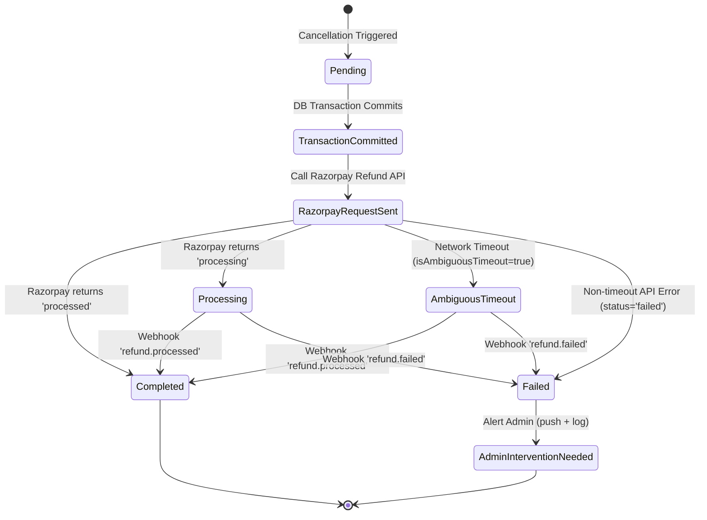

# SafeFire — Razorpay Original Payment Method Cancellation & Refund Architecture

## 1. Architecture Overview & Invariant Guarantees

For all **ONLINE (Razorpay-paid)** orders and service bookings, SafeFire executes cancellation refunds directly against the customer's **original payment source** (Credit Card, Debit Card, UPI, Netbanking) via the Razorpay Refund API.

### Core Guarantees:
1. **Zero UserWallet Credit for Online Cancellations:** Normal online cancellations **never** credit `UserWallet`. The wallet balance remains unchanged (₹0 credit).
2. **Authoritative Database Idempotency:** Idempotency is governed server-side by unique reference keys (`ORDER_CANCEL_REFUND_<orderId>`, `PARTIAL_CANCEL_REFUND_<orderId>_<scope>`, `SERVICE_CANCEL_REFUND_<bookingId>`) enforced via a unique sparse MongoDB index on `Refund.referenceId`. Razorpay's internal receipt is never relied on for idempotency.
3. **Decoupled Razorpay Side-Effects:** Razorpay external HTTP API calls execute **outside and after** the MongoDB transaction commits. If Razorpay times out or throws an error, the database state machine is preserved without orphan state or false rollbacks.
4. **Cumulative Partial Refund Protection:** Before any refund executes, the server enforces:
   $$\text{requestedRefund} \le \min(\text{vendorSubtotal}, \text{capturedAmount} - \sum \text{completedRefunds})$$
   Multi-vendor orders (e.g., Vendor A ₹600 + Vendor B ₹400 on ₹1000 payment) refund exactly ₹600 when Vendor A is cancelled and ₹400 when Vendor B is cancelled.
5. **Cash on Delivery (COD) Isolation:** COD orders/bookings process cancellation with ₹0 refund, zero Razorpay calls, and zero wallet credits.
6. **Reconciled Ambiguous Timeouts:** If a network timeout occurs during the Razorpay refund request, `Refund.status` remains `processing` and `Refund.isAmbiguousTimeout` is flagged `true`. The system does not immediately retry. The final status reconciles idempotently via the `refund.processed` webhook.
7. **Safe Test Isolation:** Automated test suites execute under `RAZORPAY_MOCK=true`. No real money or live credentials are ever touched.

---

## 2. Refund State Machine

---

## 3. Financial Endpoints & Flows

| Flow Type | Trigger Point | Controller / Service | Primary Idempotency Key | Financial Destination |
| :--- | :--- | :--- | :--- | :--- |
| **Product Full Cancellation** | Customer / Admin / Vendor | `cancellationRefundService.js` | `ORDER_CANCEL_REFUND_<orderId>` | Razorpay Original Payment Method |
| **Product Partial Cancellation** | Vendor Package Cancel | `cancellationRefundService.js` | `PARTIAL_CANCEL_REFUND_<orderId>_<vendorGroupId>` | Razorpay Original Payment Method |
| **Admin Override Cancel** | Admin Order Detail | `admin/controllers/order.controller.js` | `PARTIAL_CANCEL_REFUND_<orderId>_<vendorGroupId>` | Razorpay Original Payment Method |
| **Service Booking Cancel (Customer)** | Customer Service UI | `customerService.controller.js` | `SERVICE_CANCEL_REFUND_<bookingId>` | Razorpay Original Payment Method |
| **Service Booking Cancel (Vendor)** | Vendor Booking UI | `vendorBooking.controller.js` | `SERVICE_CANCEL_REFUND_<bookingId>` | Razorpay Original Payment Method |
| **COD Product / Service** | Any Actor | Cancellation Controllers | N/A (₹0 amount) | No money movement (₹0) |

---

## 4. Webhook Reconciliation & Webhook Replay Protection

The Razorpay webhook controller (`backend/src/modules/user/controllers/webhook.controller.js`) listens for:
- `refund.processed`:
  - Locates `Refund` by `razorpayRefundId`.
  - Idempotently updates `Refund.status = 'completed'`, sets `refundCompletedAt`.
  - Re-evaluates cumulative refunds and updates `Order.paymentStatus` / `ServiceBooking.paymentStatus` to `'refunded'`.
  - Does **not** credit `UserWallet`. Does **not** claw back vendor wallet twice.
- `refund.failed`:
  - Locates `Refund` by `razorpayRefundId`.
  - Idempotently updates `Refund.status = 'failed'` and sets `failureReason`.
  - Emits high-priority alert notification to admins.
  - Does **not** mark order as refunded or credit wallet.

---

## 5. Standard Customer Wording

In accordance with compliance standards, customer notifications and UI badges explicitly state:
- **General / Card:** `"Refund of ₹<amount> has been initiated to your original payment method."`
- **UPI:** `"Your refund has been initiated to the original payment method used for this payment. Your bank/UPI provider may take additional time to credit the amount."`
- **COD:** `"No refund applicable for Cash on Delivery."`
